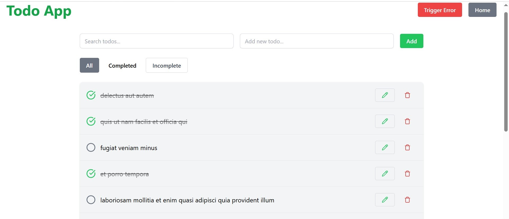
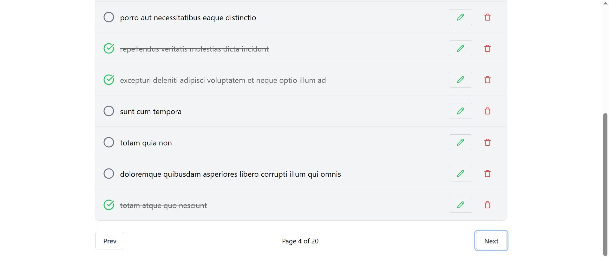
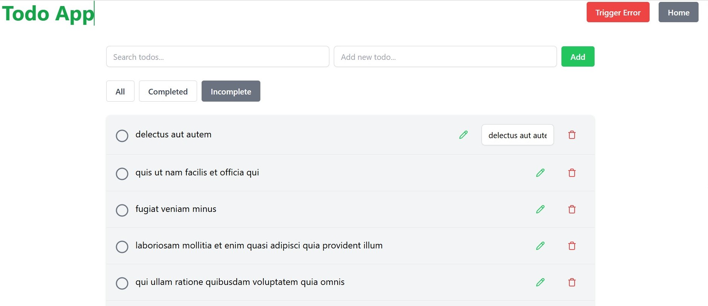
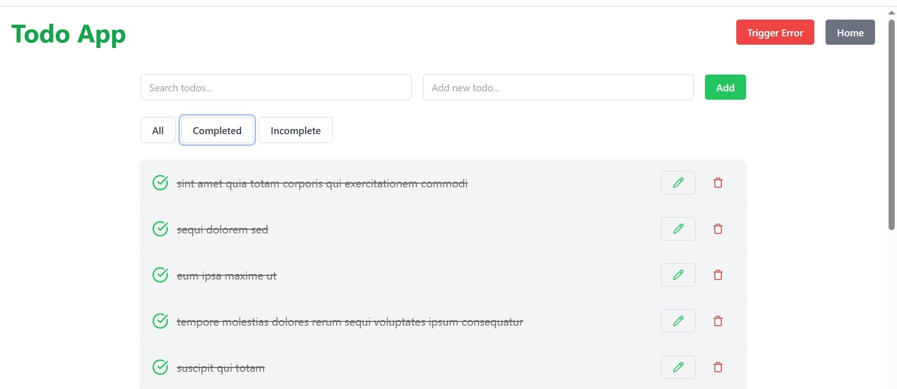
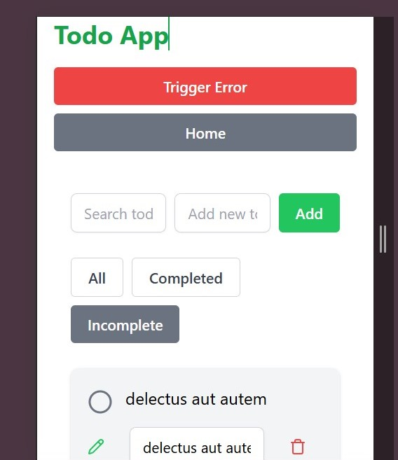
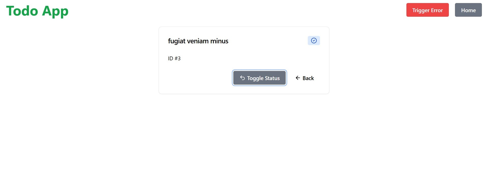
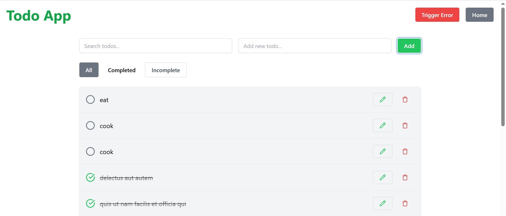
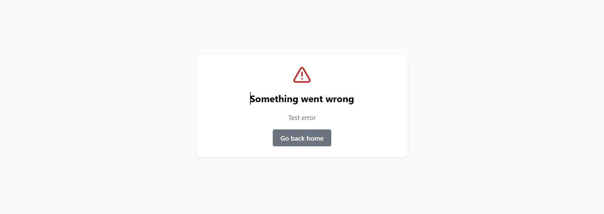

#  Todo List App

A minimal, responsive Todo List application built with **React**, **Vite**, **Tailwind CSS**, and **shadcn/ui**.

## Tech Stack

-  [React](https://reactjs.org/) + [Vite](https://vitejs.dev/) for environment 
-  [Tailwind CSS](https://tailwindcss.com/) for styling
-  [shadcn/ui](https://ui.shadcn.com/) as a UI
-  [Lucide Icons](https://lucide.dev/icons/) for icons
-  [TanStack Query](https://tanstack.com/query/latest)  used for data fetching

---

##  Screenshots









---

##  

### 1. Clone the repository

```bash
git clone https://github.com/your-username/todo-app.git
cd todo-app


2. Install dependencies
Copy
Edit
npm install

3. Start the development server
Copy
Edit
npm run dev
The app will be available at http://localhost:5173.


 Project Structure

Copy
Edit
src/
├── components/       # Reusable UI components (e.g., TodoModal, TodoList,EditTodo)
├── pages/            # Route-level pages (e.g., TodoList, AddTodo)
├── lib/              # Utility functions or client setup
├── App.jsx
├── main.jsx
├── index.css
 
```

 #  Styling & UI
This project uses:

TailwindCSS for utility-first styling.

shadcn/ui for accessible and modern component design.

Responsive layouts and mobile-friendly design by default.


# UI Features
 Create, Edit,Update, Delete Todos.

 Home button toggle 

 Add new Todo by input,then Add 

 Search Todo by title 

 Filter for completed,Incomplete and All

 Paginated List.

 Filter by Title.

 Run in the browser  http://localhost:5175/testerror for 404 page (not found).

 Error Boundaries and Test Error(to tirigger error).

 Cache API responses using localStorage (localforage)

 Local persistence (e.g., IndexedDB with Dexie.js).
---

# Commands

Command	Description
```bash
npm run dev	-Start the dev server
npm run build	-Build for production
npm run preview	-Preview the production build

